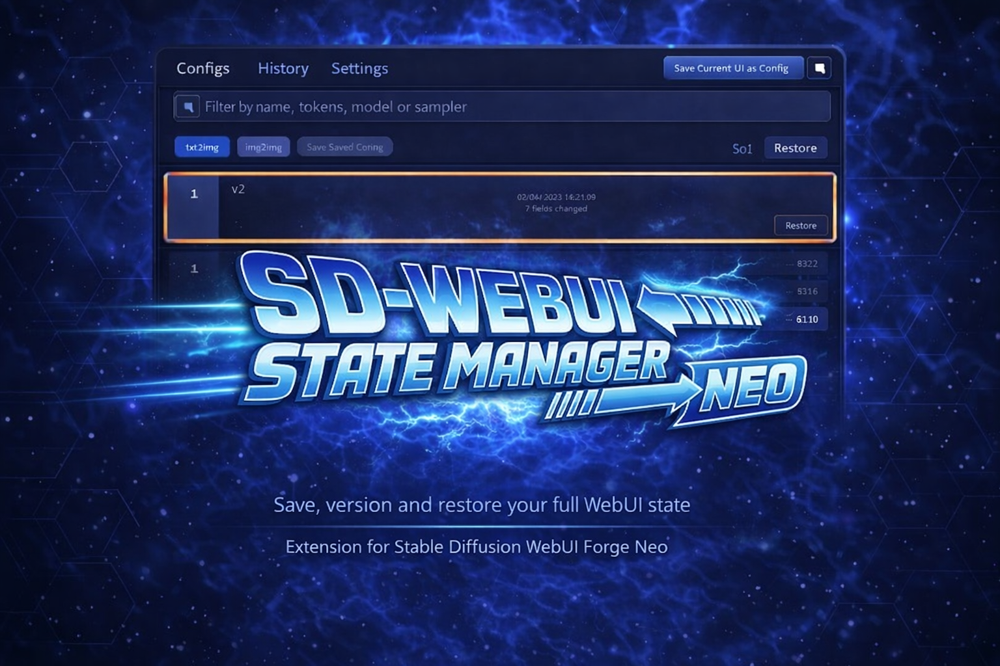

<div align="center">
  
</div>

# 💾 State Manager Neo

[](https://github.com/Haoming02/sd-webui-forge-classic/tree/neo)
[](https://gradio.app/)
[](LICENSE)
[](#-whats-new)

> **Extension for [Stable Diffusion WebUI Forge Neo](https://github.com/Haoming02/sd-webui-forge-classic/tree/neo)**

Save your full txt2img/img2img setup once — model, sampler, prompts, Hires settings, scripts, and all UI values — and bring it back instantly whenever you need it.

---

## 📋 Table of Contents

- [What's New](#-whats-new)
- [Changelog](#-changelog)
- [Roadmap](#️-roadmap)
- [Features](#-features)
- [Installation](#-installation)
- [Quick Start](#-quick-start)
- [Credits](#-credits)

---

## 🆕 What's New

### v0.0.2 — Version History UX

- **Config overwrite creates version history** — each Save Changes archives the previous state into History
- **History version cards are preview-first** — click a card to preview, use Restore to apply
- **Vertical version list** with compact summary and change count per version
- **History startup layout is stable** — no horizontal flash on first load
- **Last version card no longer clipped** at the bottom of the list
- **Schedule Type support** improved in save/restore inspector coverage

---

## 📖 Changelog

### v0.0.2 — Version History UX

- Save Changes on an existing config archives the previous state into History
- Version entries show version number, timestamp, and short change summary
- History supports cleaner version browsing and restore flow
- Startup layout in History stabilized to prevent first-load horizontal flicker
- History version list container sizing corrected to prevent bottom clipping
- Search and sampler-related mapping coverage improved

### v0.0.1 — Forge Neo Baseline

- Fixed initialization race issues on Forge Neo
- Fixed undefined preview values in key generation fields
- Added missing Hires CFG fields to capture/restore flow
- Sampling and batch values fixed in previews
- Negative Prompt capture reliability improved
- Hires Distilled CFG Scale covered for txt2img/img2img

---

## 🗺️ Roadmap

### v0.0.2 — Version History UX *(complete)* ✅

### v0.1.0 *(planned)*

- Expanded field coverage (Refiner and script-specific values)
- Better metadata options for configs
- Thumbnail support in History version cards

### v0.2.0 *(planned)*

- Pinned/favorite config improvements
- Config import/export
- Side-by-side version comparison tools

---

## 🎯 Features

> ⭐ = exclusive to Neo fork

### 💾 Save and Restore

- Save complete txt2img or img2img state in one click
- Restore full config or apply selected fields only
- Works well for frequent style/project switching
- Startup auto-apply option for default configs

### 🗂️ Config Workflow

- Named reusable configs with search and filter support
- **Save Changes** flow for iterative edits without losing previous state
- Inspector shows which fields differ between saved config and current UI

### 📜 History Workflow ⭐

- Every Save Changes archives the previous config version automatically
- Version list shows version number, timestamp, and change summary
- Click any version card to preview it in the inspector — without applying
- Restore exactly the version you want with a single click
- History reloads automatically after each Save Changes

---

## 📦 Installation

1. Open Forge Neo and go to **Extensions**
2. Click **Install from URL**
3. Paste:

```text
https://github.com/eduardoabreu81/sd-webui-state-manager-neo
```

4. Click **Install** and reload the WebUI

> ⚠️ This extension is for **Forge Neo** only.
>
> For other environments, use the original [sd-webui-state-manager](https://github.com/SenshiSentou/sd-webui-state-manager).

---

## 🚀 Quick Start

1. Set up your generation screen the way you want
2. Open State Manager and save a config
3. Change your UI settings and click **Save Changes** to update the config
4. Go to **History** to see the version trail for that config
5. Click any version card to preview the diff — then hit **Restore** to apply it

---

## 📄 Credits

- 🧩 [sd-webui-state-manager](https://github.com/SenshiSentou/sd-webui-state-manager) by SenshiSentou — original project and core architecture
- 🔧 [sd-webui-state-manager-continued](https://github.com/dane-9/sd-webui-state-manager-continued) by dane-9 — continued maintenance and fixes
- 🧱 [Forge Neo](https://github.com/Haoming02/sd-webui-forge-classic/tree/neo) by Haoming02 — platform this extension targets

### What Is Different In This Neo Fork

- ⭐ Version-focused History workflow (preview-first cards + restore by version)
- ⭐ History reloads automatically after Save Changes
- 🛡️ Safer restore behavior — browse versions without destructive auto-apply
- 🎯 Forge Neo-specific compatibility hardening for state capture and restore
- 🧭 Cleaner config iteration with Save Changes + full version trail

---

## 📜 License

MIT — see [LICENSE](LICENSE)

---

<div align="center">

Made with ❤️ for the Stable Diffusion community

**[Report Bug](https://github.com/eduardoabreu81/sd-webui-state-manager-neo/issues)** • **[Request Feature](https://github.com/eduardoabreu81/sd-webui-state-manager-neo/issues)** • **[Discussions](https://github.com/eduardoabreu81/sd-webui-state-manager-neo/discussions)** • **[☕ Ko-fi](https://ko-fi.com/eduardoabreu81)**

</div>
