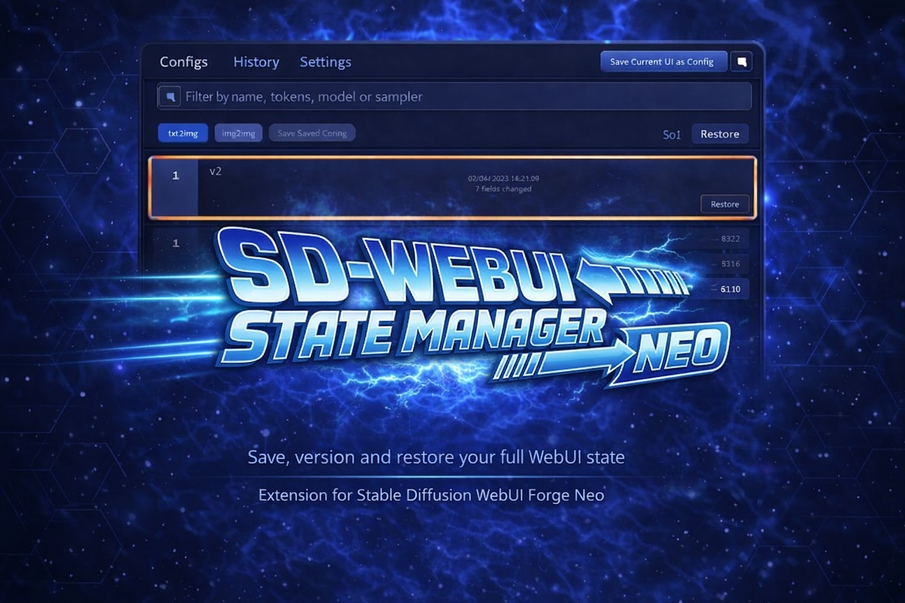

<div align="center">
  
</div>

# 💾 State Manager Neo

<div align="center">

[](https://github.com/Haoming02/sd-webui-forge-classic/tree/neo)
[](LICENSE)
[](#-whats-new)

> **Extension for [Stable Diffusion WebUI Forge Neo](https://github.com/Haoming02/sd-webui-forge-classic/tree/neo)**

</div>

Save your full txt2img/img2img setup once — model, sampler, prompts, Hires settings, scripts, and all UI values — and bring it back instantly whenever you need it.

---

## 📋 Table of Contents

- [What's New](#-whats-new)
- [Changelog](#-changelog)
- [Roadmap](#️-roadmap)
- [Features](#-features)
- [Installation](#-installation)
- [Quick Start](#-quick-start)
- [Credits](#-credits)

---

## 🆕 What's New

### v0.0.3 — Reliable Application and Portable Configs

- Sampler, steps and schedule type resolve through live Forge controls in txt2img and img2img
- CFG Scale and Denoising Strength keep explicit compatibility fallbacks
- **Save Config** opens an inline name field: Enter saves, Escape or Cancel closes it
- Save confirmation waits for successful storage; failed saves keep existing configs intact
- Automatic version history remains enabled when saving changes to an existing config
- Complete config application waits for options and reports applied, unavailable and failed fields
- **Undo** restores values captured before the last complete application, including options
- **Export JSON** shares an individual config with its original effective values
- **Import JSON** previews values and compatibility, then saves a new config without overwriting or applying it
- Unavailable choices are skipped when exposed by the host; numeric and boolean comparisons correctly detect differences
- Narrow modal layouts accommodate the application feedback and import controls

### v0.0.2 — Version History UX

- **Config overwrite creates version history** — each Save Changes archives the previous state into History
- **History version cards are preview-first** — click a card to preview, use Restore to apply
- **Vertical version list** with compact summary and change count per version
- **History startup layout is stable** — no horizontal flash on first load
- **Last version card no longer clipped** at the bottom of the list
- **Schedule Type support** improved in save/restore inspector coverage

---

## 📖 Changelog

### v0.0.3 — Reliable Application and Portable Configs

- Await complete config application and show per-field results with expandable details
- Add one-level Undo, retaining only unfinished fields when restoration needs a retry
- Export individual configs with their original effective defaults and explicit overrides
- Import validated JSON through a preview, with a new identity and confirmed storage
- Improve sampler, steps, scheduler, CFG and denoising capture/restore compatibility
- Add inline naming and reliable save completion for IndexedDB and file storage
- Correct comparisons of numeric and boolean UI values and improve narrow modal layouts
- Preserve automatic config version history and keep TypeScript and shipped JavaScript synchronized

### v0.0.2 — Version History UX

- Save Changes on an existing config archives the previous state into History
- Version entries show version number, timestamp, and short change summary
- History supports cleaner version browsing and restore flow
- Startup layout in History stabilized to prevent first-load horizontal flicker
- History version list container sizing corrected to prevent bottom clipping
- Search and sampler-related mapping coverage improved

### v0.0.1 — Forge Neo Baseline

- Fixed initialization race issues on Forge Neo
- Fixed undefined preview values in key generation fields
- Added missing Hires CFG fields to capture/restore flow
- Sampling and batch values fixed in previews
- Negative Prompt capture reliability improved
- Hires Distilled CFG Scale covered for txt2img/img2img

---

## 🗺️ Roadmap

### v0.0.3 — Reliable Application and Portable Configs *(complete)* ✅

### v0.0.2 — Version History UX *(complete)* ✅

### v0.1.0 *(planned)*

- Expanded field coverage (Refiner and script-specific values)
- Better metadata options for configs
- Thumbnail support in History version cards

### v0.2.0 *(planned)*

- Pinned/favorite config improvements
- Batch config import/export and migration tools
- Side-by-side version comparison tools

---

## 🎯 Features

> ⭐ = exclusive to Neo fork

### 💾 Save and Restore

- Save complete txt2img or img2img state in one click
- Restore full config or apply selected fields only
- Works well for frequent style/project switching
- Startup auto-apply option for default configs
- Application result with expandable per-field details and one-level Undo

### 🗂️ Config Workflow

- Named reusable configs with search and filter support
- **Save Changes** flow for iterative edits without losing previous state
- Inspector shows which fields differ between saved config and current UI
- Individual portable JSON export/import with a preview and explicit confirmation

### 📜 History Workflow ⭐

- Every Save Changes archives the previous config version automatically
- Version list shows version number, timestamp, and change summary
- Click any version card to preview it in the inspector — without applying
- Restore exactly the version you want with a single click
- History reloads automatically after each Save Changes

---

## 📦 Installation

1. Open Forge Neo and go to **Extensions**
2. Click **Install from URL**
3. Paste:

```text
https://github.com/eduardoabreu81/sd-webui-state-manager-neo
```

4. Click **Install** and reload the WebUI

> ⚠️ This extension is for **Forge Neo** only.
>
> For other environments, use the original [sd-webui-state-manager](https://github.com/SenshiSentou/sd-webui-state-manager).

---

## 🚀 Quick Start

1. Set up your generation screen the way you want
2. Open State Manager, click **Save Config**, enter a name and press **Enter** or **Save**
3. Change your UI settings and click **Save Changes** to update the config
4. Go to **History** to see the version trail for that config
5. Click any version card to preview the diff — then hit **Restore** to apply it

After a complete application, check the result above the list. **Details** identifies
fields that are unavailable or failed; **Undo** restores the preceding values. Undo
is kept in memory until the next complete application or page reload. It does not
create history entries and does not cover individual inspector field loads. If
some fields cannot be restored, Undo retains those fields for a retry. Later edits
to fields covered by Undo will also be replaced when you use it.

To share an entry, select it and click **Export JSON** in the inspector. The file
contains saved defaults plus explicit overrides, including prompts and options.
It excludes history, entry identity, thumbnails, and model files.

To bring it back, click **Import JSON** in the list toolbar, choose the file, review
**Preview values**, and edit the import name if needed. **Import as New Config**
waits for successful storage. Matching names still create separate entries. Import
preserves unsupported fields so you can move the file between installations; it
does not apply values or install models/extensions. Version 1 files are limited
to 2 MB and 1,000 settings per map.

Application results verify UI values and the options API after writing them.
Model loading and generation remain the responsibility of the Forge host.

---

## 📄 Credits

- 🧩 [sd-webui-state-manager](https://github.com/SenshiSentou/sd-webui-state-manager) by SenshiSentou — original project and core architecture
- 🔧 [sd-webui-state-manager-continued](https://github.com/dane-9/sd-webui-state-manager-continued) by dane-9 — continued maintenance and fixes
- 🧱 [Forge Neo](https://github.com/Haoming02/sd-webui-forge-classic/tree/neo) by Haoming02 — platform this extension targets

### What Is Different In This Neo Fork

- ⭐ Version-focused History workflow (preview-first cards + restore by version)
- ⭐ History reloads automatically after Save Changes
- 🛡️ Safer restore behavior — browse versions without destructive auto-apply
- 🎯 Forge Neo-specific compatibility hardening for state capture and restore
- 🧭 Cleaner config iteration with Save Changes + full version trail

---

## 📜 License

MIT — see [LICENSE](LICENSE)

---

<div align="center">

Made with ❤️ for the Stable Diffusion community

**[Report Bug](https://github.com/eduardoabreu81/sd-webui-state-manager-neo/issues)** • **[Request Feature](https://github.com/eduardoabreu81/sd-webui-state-manager-neo/issues)** • **[Discussions](https://github.com/eduardoabreu81/sd-webui-state-manager-neo/discussions)** • **[☕ Ko-fi](https://ko-fi.com/eduardoabreu81)**

</div>
